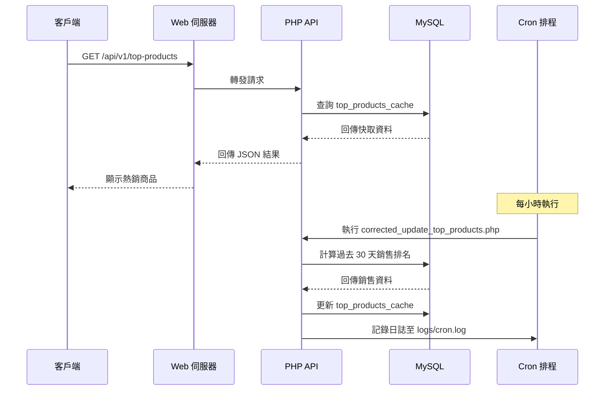

# Ecommerce Top Products API

這是一個輕量級的 PHP 電子商務 API，專為查詢過去 30 天內前 10 名熱銷商品設計，透過快取資料表優化效能，適合中小型電商平台使用。採用 PHP 7.4+ 和 MySQL 5.7+，每小時更新快取資料，兼顧效率與相容性。

[](https://opensource.org/licenses/MIT)
[](https://www.php.net/)
[](https://www.mysql.com/)
[](https://getcomposer.org/)

## 功能特色

- **熱銷商品端點**：提供前 10 名商品的 ID、名稱、價格、圖片 URL 和銷售量。
- **快取資料**：使用 `top_products_cache` 表儲存預計算排名，減少資料庫負載。
- **每小時更新**：透過 Cron 排程每小時更新快取，確保資料新鮮且無即時計算開銷。
- **多語言支援**：採用 UTF-8（utf8mb4）處理多語言商品名稱。
- **錯誤處理**：提供詳細日誌記錄與 JSON 錯誤回應，方便除錯。
- **安全配置**：使用 `.env` 儲存敏感資料（如資料庫憑證）。

## 系統架構圖

以下 Mermaid 序列圖展示客戶端請求熱銷商品的流程，涵蓋前端、API、MySQL 和快取更新的交互。



## 技術棧

- **後端**：PHP 7.4+、PDO
- **資料庫**：MySQL 5.7+
- **依賴管理**：Composer（vlucas/phpdotenv、monolog/monolog）
- **伺服器**：Apache 或 Nginx
- **排程**：Cron

## 環境需求

- PHP 7.4+（含 PDO 和 MySQL 擴展）
- MySQL 5.7+
- Composer
- Web 伺服器（Apache 或 Nginx）
- Cron（用於快取更新）
- 檔案權限：`logs/` 目錄需可寫

## 安裝步驟

### 1. 複製專案

```bash
git clone https://github.com/BpsEason/ecommerce-top-products-api.git
cd ecommerce-top-products-api
```

### 2. 安裝依賴

使用 Composer 安裝必要套件：

```bash
composer require vlucas/phpdotenv monolog/monolog
```

### 3. 設定環境變數

複製並編輯 `.env`：

```bash
cp .env.example .env
```

範例 `.env`：

```env
DB_HOST=localhost
DB_NAME=ecommerce
DB_USER=your_db_user
DB_PASS=your_db_password
```

### 4. 設定資料庫

匯入 SQL 結構：

```bash
mysql -u your_db_user -p ecommerce < sql/schema.sql
```

### 5. 配置日誌

建立日誌目錄並設定權限：

```bash
mkdir logs
chmod 775 logs
```

### 6. 設定 Cron 排程

編輯 Cron 設定，每小時執行快取更新：

```bash
crontab -e
```

新增以下行：

```bash
0 * * * * /usr/bin/php /path/to/ecommerce-top-products-api/src/corrected_update_top_products.php >> /path/to/ecommerce-top-products-api/logs/cron.log 2>&1
```

### 7. 部署 API

- 將專案置於 Web 伺服器根目錄（例如 `/var/www/html`）。
- 確保 `src/corrected_api.php` 可透過網址訪問（例如 `http://your-server/api/v1/top-products`）。
- 配置伺服器處理 PHP 請求。

**Nginx 配置範例**：

```nginx
server {
    listen 80;
    server_name your-server;
    root /path/to/ecommerce-top-products-api/src;
    index corrected_api.php;

    location ~ \.php$ {
        include fastcgi_params;
        fastcgi_pass unix:/run/php/php7.4-fpm.sock; # 依 PHP 版本調整
        fastcgi_index corrected_api.php;
        fastcgi_param SCRIPT_FILENAME $document_root$fastcgi_script_name;
    }
}
```

## 使用方式

### API 端點

- **GET /api/v1/top-products**
  - 查詢前 10 名熱銷商品（從快取讀取）。
  - **回應格式**：JSON
  - **範例請求**：

```bash
curl http://your-server/api/v1/top-products
```

  - **範例回應**：

```json
{
    "success": true,
    "data": [
        {
            "product_id": 1,
            "name": "Laptop Pro",
            "price": 999.99,
            "image_url": "https://example.com/images/laptop.jpg",
            "sales_count": 150
        },
        ...
    ],
    "message": "熱銷商品查詢成功"
}
```

  - **錯誤回應**：
    - **404 未找到**：

```json
{
    "success": false,
    "error": "未找到",
    "message": "請求的資源不存在"
}
```

    - **500 伺服器錯誤**：

```json
{
    "success": false,
    "error": "伺服器錯誤",
    "message": "資料庫連線或查詢失敗"
}
```

### 快取更新

- `corrected_update_top_products.php` 每小時更新 `top_products_cache` 表。
- 根據過去 30 天內狀態為 `shipped` 或 `delivered` 的訂單計算銷售量。
- 日誌記錄於 `logs/app.log` 和 `logs/cron.log`。

## 專案結構

```
ecommerce-top-products-api/
├── src/
│   ├── config.php              # 資料庫與環境配置
│   ├── corrected_api.php       # API 端點
│   ├── corrected_update_top_products.php # 快取更新腳本
├── sql/
│   └── schema.sql             # 資料庫結構
├── logs/
│   ├── app.log               # 應用日誌
│   ├── cron.log              # Cron 日誌
├── vendor/                    # Composer 依賴
├── .env                       # 環境變數（不提交）
├── .env.example               # 環境範例檔案
├── .gitignore                 # Git 忽略檔案
├── composer.json              # Composer 配置
├── LICENSE                    # MIT 授權
└── README.md                  # 專案說明
```

## 測試方式

### 1. API 測試

使用 `curl` 或 Postman 測試端點：

```bash
curl http://your-server/api/v1/top-products
```

確認回應包含 `success: true` 和商品列表。

### 2. 快取更新測試

手動執行更新腳本：

```bash
php src/corrected_update_top_products.php
```

檢查 `logs/app.log` 的成功訊息與 `top_products_cache` 表的更新資料。

### 3. 資料庫驗證

查詢快取表：

```sql
SELECT * FROM top_products_cache ORDER BY rank_order ASC;
```

確認資料符合預期排名。

## 貢獻方式

歡迎貢獻！請遵循以下步驟：

1. Fork 本專案。
2. 建立功能分支：`git checkout -b feature/YourFeature`
3. 提交變更：`git commit -m 'Add YourFeature'`
4. 推送分支：`git push origin feature/YourFeature`
5. 在 [GitHub](https://github.com/BpsEason/ecommerce-top-products-api) 開啟 Pull Request，清楚說明變更內容。

如有問題或建議，請透過 GitHub Issues 反饋。

## 授權

本專案採用 [MIT 授權](LICENSE)。

## 鳴謝

- 感謝 [PHP](https://www.php.net/)、[MySQL](https://www.mysql.com/) 和 [Composer](https://getcomposer.org/) 提供穩定基礎。
- 使用 [vlucas/phpdotenv](https://github.com/vlucas/phpdotenv) 管理環境變數，[monolog/monolog](https://github.com/Seldaek/monolog) 記錄日誌。
- 靈感來自電商 API 的效能與擴展性設計。
